<a id="top"></a>

<p align="center">
  <picture>
    <source media="(max-width: 640px) and (prefers-color-scheme: dark)" srcset="docs/readme/banner-dark-narrow.svg">
    <source media="(max-width: 640px)" srcset="docs/readme/banner-light-narrow.svg">
    <source media="(prefers-color-scheme: dark)" srcset="docs/readme/banner-dark.svg">
    
  </picture>
</p>

<p align="center">
  <b>Log the climate actions you already take. Get an honest estimate. Watch a living 3D island grow.</b><br>
  No account. No feed. No doomscrolling. Everything stays in your browser.
</p>

<p align="center">
  <a href="#try-it"><b>Try it</b></a> &nbsp;·&nbsp;
  <a href="#take-the-tour"><b>Take the tour</b></a> &nbsp;·&nbsp;
  <a href="#why-you-can-trust-the-numbers"><b>The numbers</b></a> &nbsp;·&nbsp;
  <a href="#how-it-works"><b>How it works</b></a> &nbsp;·&nbsp;
  <a href="#getting-started"><b>Getting started</b></a> &nbsp;·&nbsp;
  <a href="#honest-limits"><b>Honest limits</b></a>
</p>

<p align="center">
  
  
  
  
  
  
</p>

<p align="center">
  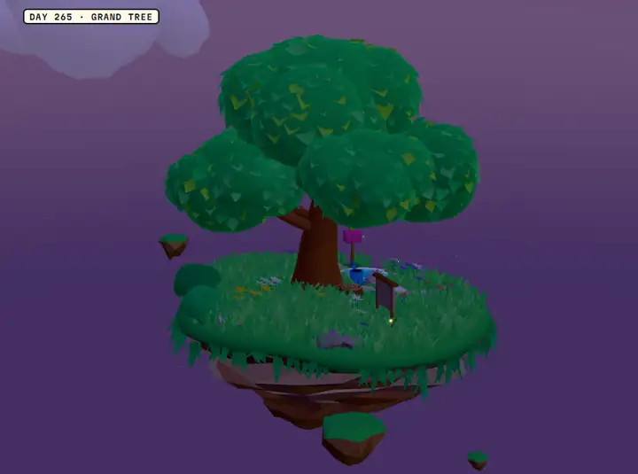
  <br>
  <sub>Captured from the running app, not drawn: the landing page's time-lapse of a first year. The sky keeps its own clock.</sub>
</p>

## What it is

- **You log.** A bus instead of a car, a plant-based meal, a shorter shower. A few seconds each.
- **It answers honestly.** About how much CO2e that avoided, compared with what, within which range, from which source.
- **Your tree grows.** A living 3D island that is yours alone. Miss a day and it rains. The tree never dies.

<p align="center">
  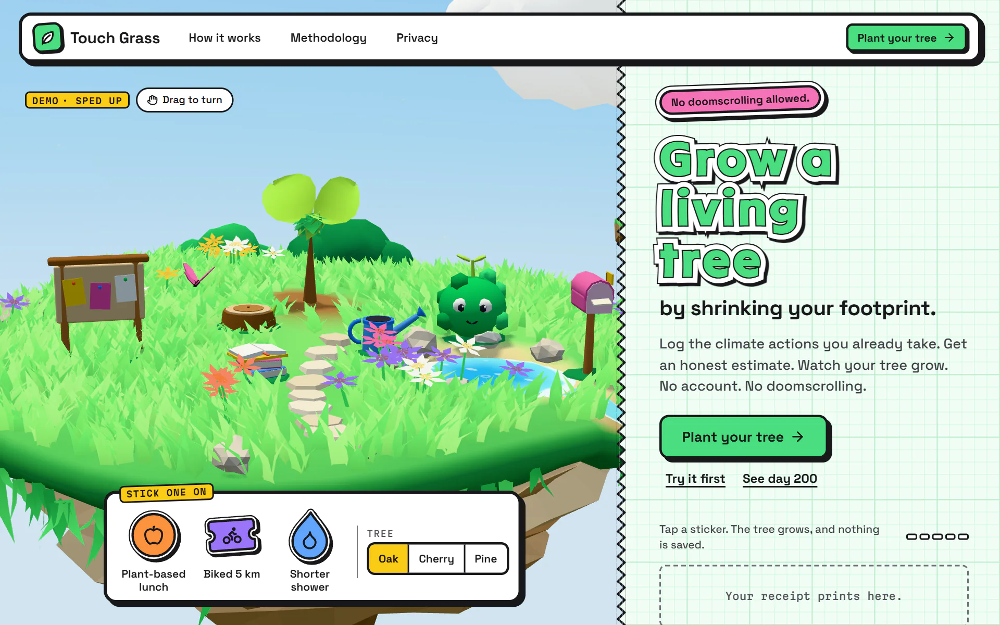
  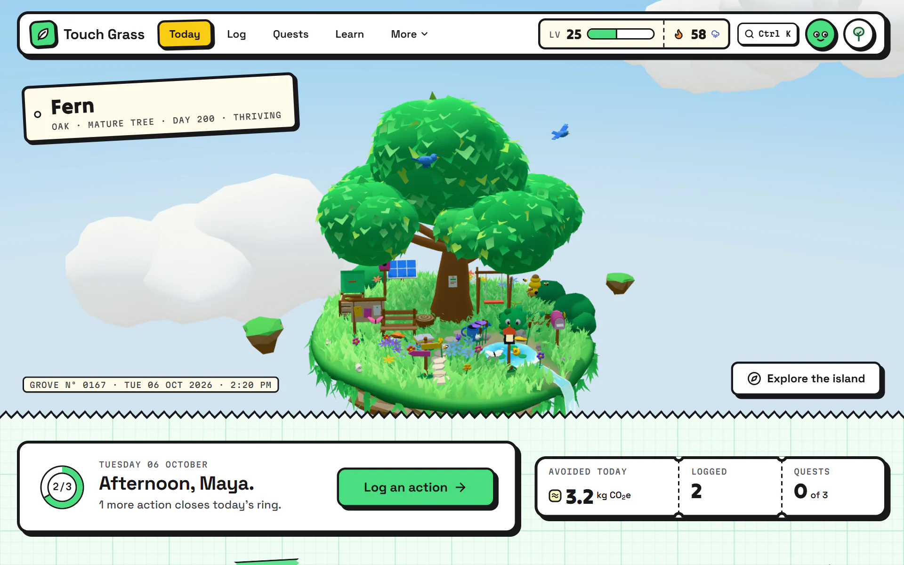
  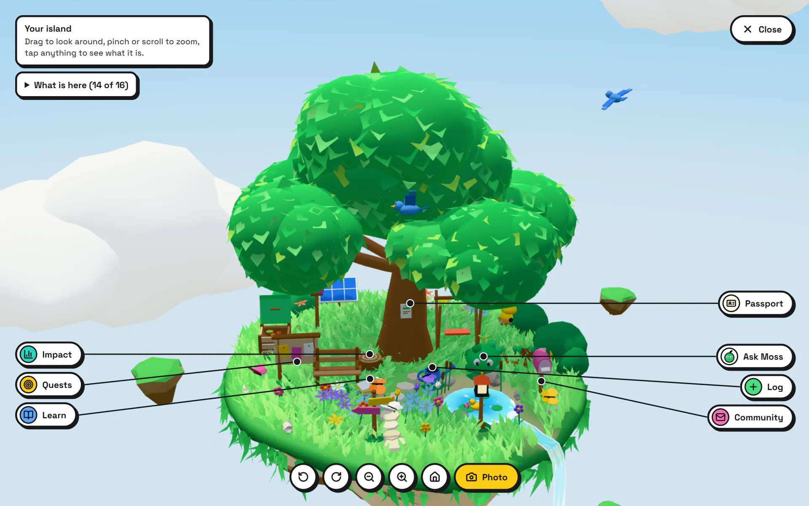
</p>
<p align="center">
  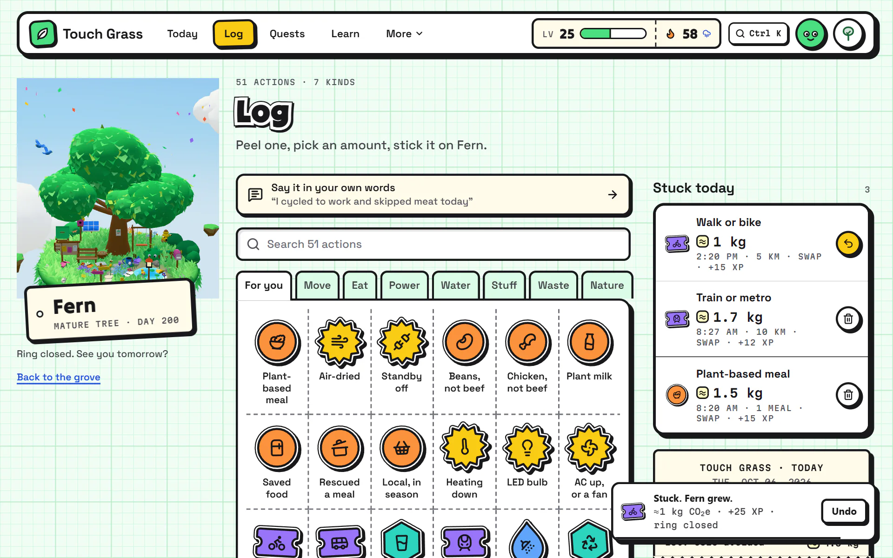
  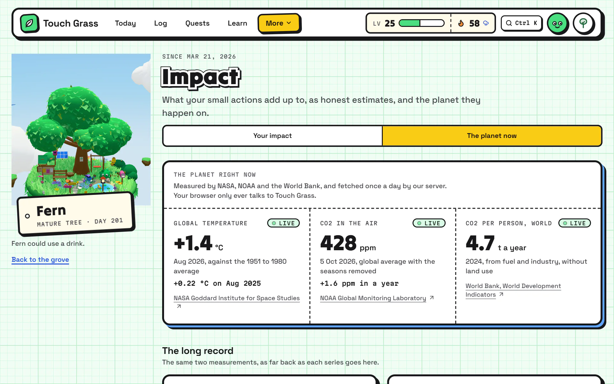
  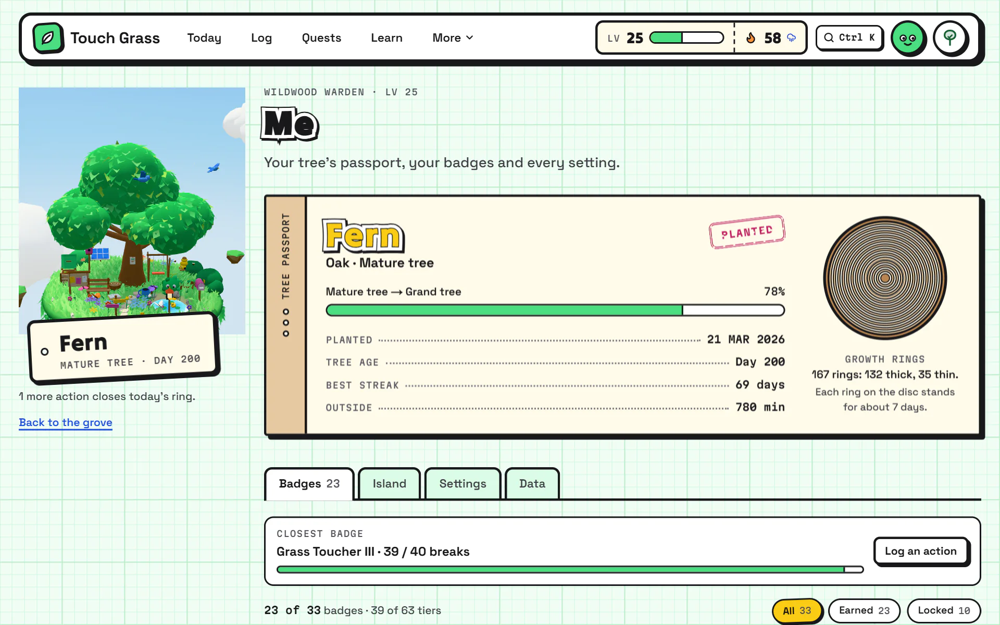
</p>
<p align="center"><sub>Landing · Today · Explore · Log · Impact · Me. Click any picture to see it full size.</sub></p>

## Try it

There is no hosted copy yet, so the way in is to run it. Clone, install, go.

```bash
git clone https://github.com/shubhamjh15/touch-grass.git
cd touch-grass
npm install
npm run dev
```

Then open `http://localhost:5173`.

| Path | What you get |
| --- | --- |
| `/` | The landing page. Tap a sticker under the tree: it grows, and nothing is saved. |
| `/demo` | **A grown world.** Two hundred days replayed through the real rules, in a sandbox that never touches your own data, with a four-step tour. |
| `/start` | Plant your own. A name, a species, and no account. |

You need Node 20.19 or newer. No keys, no configuration: the built-in coach answers without one.

<details>
<summary><b>Keyboard shortcuts</b> (press <kbd>?</kbd> in the app for the same list)</summary>
<br>

| Keys | What they do |
| --- | --- |
| <kbd>Ctrl</kbd> <kbd>K</kbd> or <kbd>/</kbd> | Search and commands (<kbd>⌘</kbd> <kbd>K</kbd> on a Mac) |
| <kbd>L</kbd> | Log an action |
| <kbd>C</kbd> | Ask Moss, the coach |
| <kbd>G</kbd> then <kbd>T</kbd> <kbd>L</kbd> <kbd>Q</kbd> <kbd>E</kbd> <kbd>I</kbd> <kbd>C</kbd> <kbd>O</kbd> <kbd>M</kbd> | Go to Today, Log, Quests, Learn, Impact, Community, Moss, Me |
| <kbd>←</kbd> <kbd>→</kbd> | Turn the island, when it has the focus |
| <kbd>↑</kbd> <kbd>↓</kbd> | Tip the camera |
| <kbd>Home</kbd> | Bring the front of the island back |
| <kbd>F6</kbd> | Move between the page and the coach drawer |
| <kbd>Esc</kbd> | Close a sheet, or skip a celebration |

Single keys work whenever you are not typing in a field.

</details>

<p align="right"><a href="#top">Back to top ↑</a></p>

## Take the tour

Eight stops. Click one to open it.

<details open>
<summary><b>1 · The world</b> &nbsp;an island that is alive</summary>
<br>
<p align="center">
  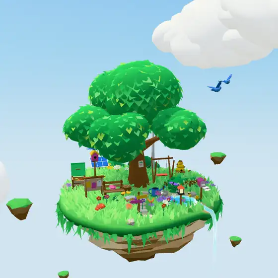
</p>

- One WebGL scene, generated entirely in code. There is not a single model file.
- It follows **your clock**: dawn, day, golden hour, a moonlit night. It also follows your tree's health.
- Drag to turn it, or use <kbd>←</kbd> and <kbd>→</kbd>. Tap the tree and leaves fall. Tap a prop and a note says what earned it.
- **Explore** opens it full screen, with a photo button.
- Nine growth stages, three species, 16 props that arrive as you earn badges. Where WebGL is missing, an illustrated tree takes its place.

<p align="center">
  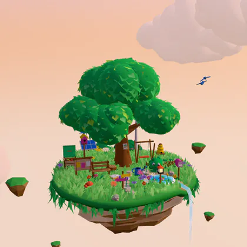
  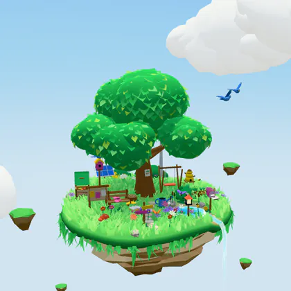
  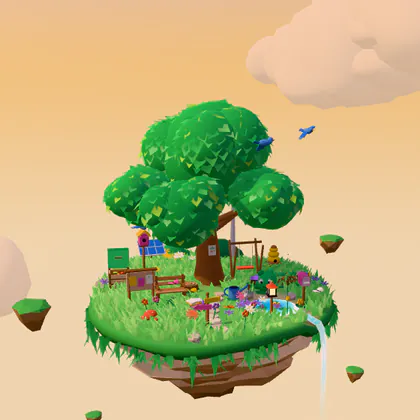
  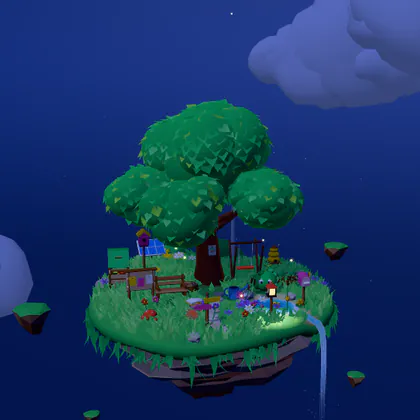
</p>
<p align="center"><sub>The same island at dawn, by day, at golden hour and at night.</sub></p>

<p align="center">
  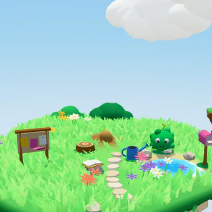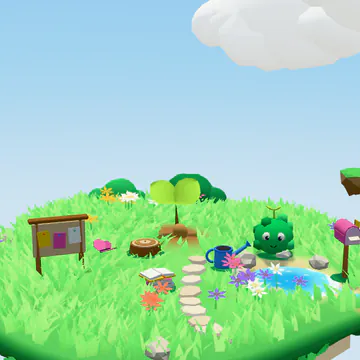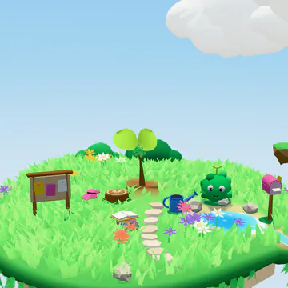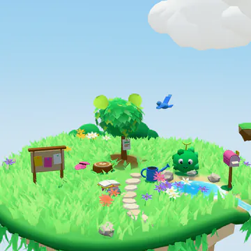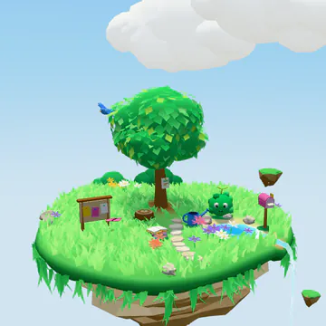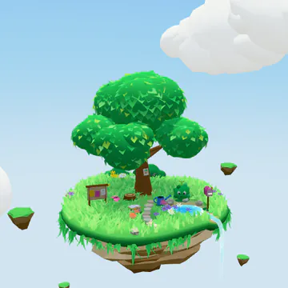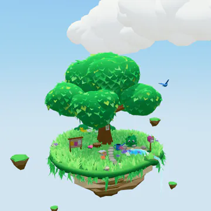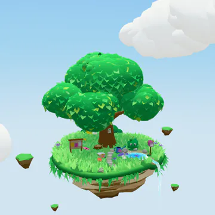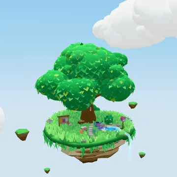
</p>
<p align="center"><sub>Seed → Sprout → Seedling → Sapling → Young tree → Mature tree → Grand tree → Elder → Ancient</sub></p>

<p align="center">
  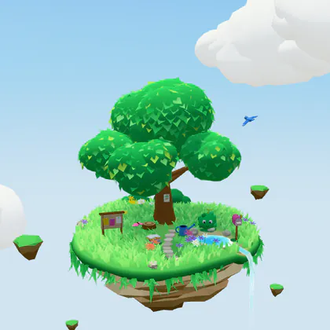
  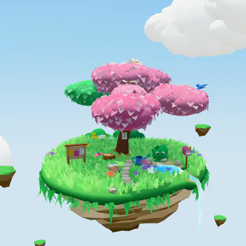
  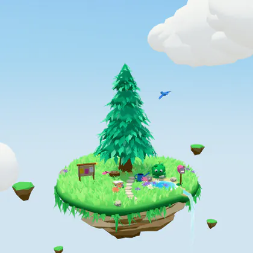
</p>
<p align="center"><sub>Oak, cherry and pine.</sub></p>

</details>

<details>
<summary><b>2 · Logging</b> &nbsp;a few seconds, then a receipt</summary>
<br>
<p align="center">
  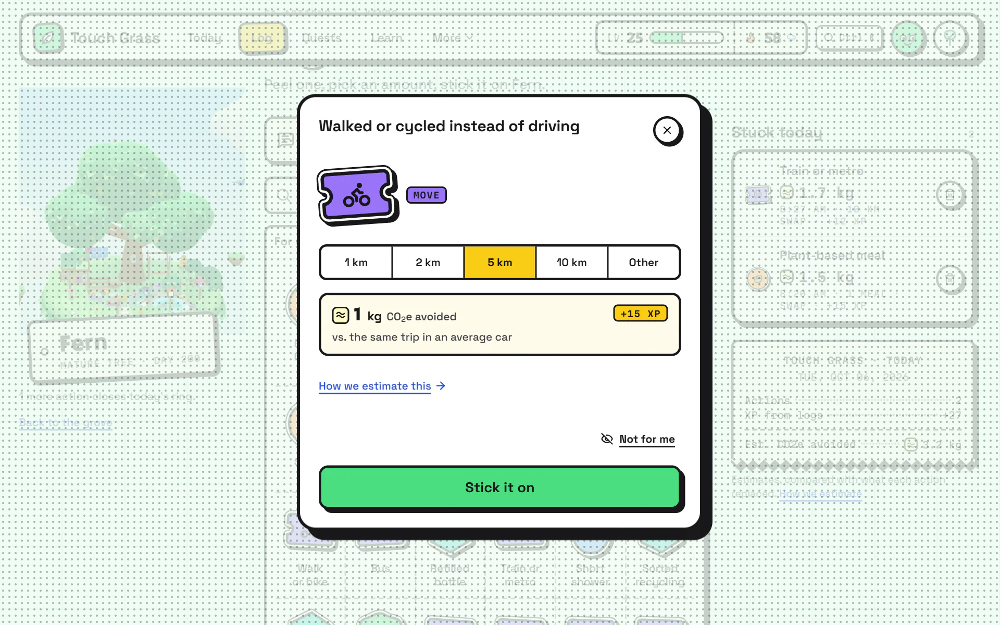
</p>

- 51 catalogued actions in seven kinds: Move, Eat, Power, Water, Stuff, Waste, Nature.
- Pick an amount and you see the estimate **before** you commit.
- Or say it in your own words. "I cycled to work and skipped meat today" finds the matching actions. Nothing is logged until you confirm.
- Every log prints a receipt with **Undo**. Not in the catalogue? Describe a custom action.
- <kbd>L</kbd> opens Log from anywhere.

</details>

<details>
<summary><b>3 · Honest numbers</b> &nbsp;every figure shows its working</summary>
<br>
<p align="center">
  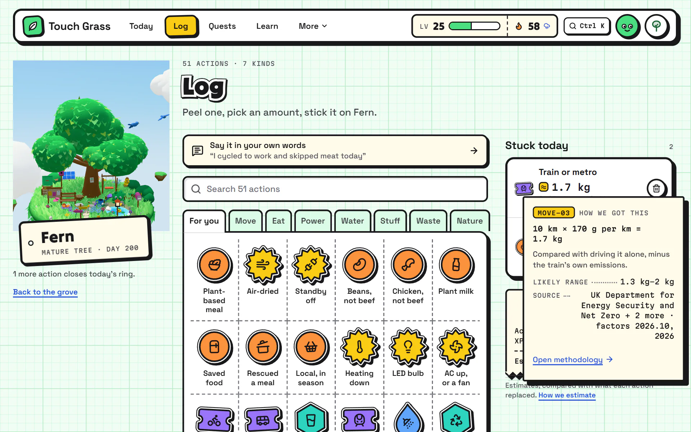
</p>

- Every figure is an estimate and wears the "≈" mark, rounded to two significant figures.
- The mark opens the working: the formula, what it was compared with, a likely range and the source.
- 41 of the 51 actions have a sourced factor. The other 10, such as litter picking, have no credible number, so the app prints none.
- The whole factor table and all 55 sources are on the app's `/methodology` page.

</details>

<details>
<summary><b>4 · The game</b> &nbsp;kind rules</summary>
<br>
<p align="center">
  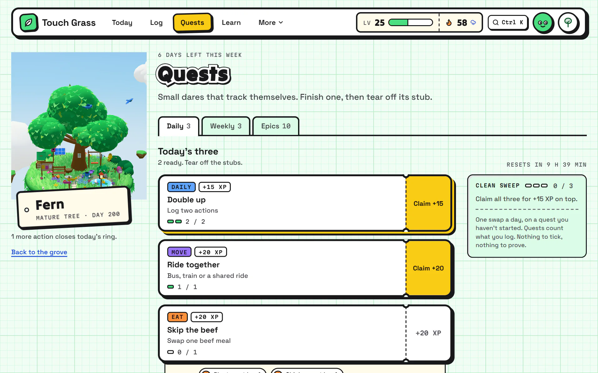
</p>

- Three actions close the day's ring. Three daily and three weekly quests track themselves from what you log.
- 33 badges, levels, and 12 epics for the long haul.
- XP is for effort, growth points grow the tree, kilograms measure impact. The three **never convert**, so a bigger footprint cannot win.
- Miss a day and it rains. After a week away the tree rests. Nothing you earned is ever taken away.

</details>

<details>
<summary><b>5 · Impact and the planet</b> &nbsp;your numbers, next to the planet's</summary>
<br>
<p align="center">
  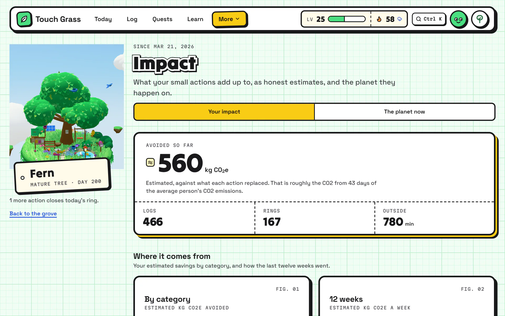
  
</p>

- Your totals by category, the last 12 weeks, an activity calendar and your pace against your starting line.
- Beside them, five readings from public sources: global temperature (NASA GISTEMP), CO2, methane and nitrous oxide in the air (NOAA), and CO2 per person (World Bank).
- Our own server fetches them, so your browser never calls a third party.
- A reading says **Live** only when the server fetched it in the last 36 hours. Otherwise it says "Snapshot from" and the date.

</details>

<details>
<summary><b>6 · The coach</b> &nbsp;Moss works with a key, and without one</summary>
<br>
<p align="center">
  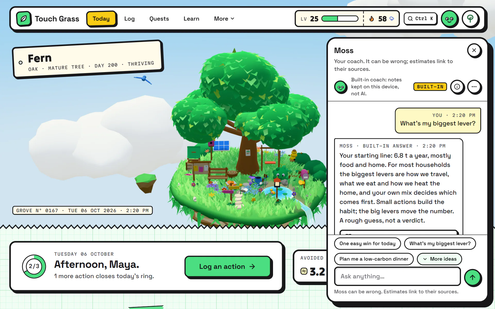
</p>

- With no key, a built-in coach answers from your own log, and labels itself **Built-in**.
- With one free API key it becomes a live model, called through our server. The key never reaches the browser.
- Moss can suggest an action. Only you can log one.
- <kbd>C</kbd> opens Moss from anywhere.

</details>

<details>
<summary><b>7 · The demo world</b> &nbsp;day 200, in about three seconds</summary>
<br>
<p align="center">
  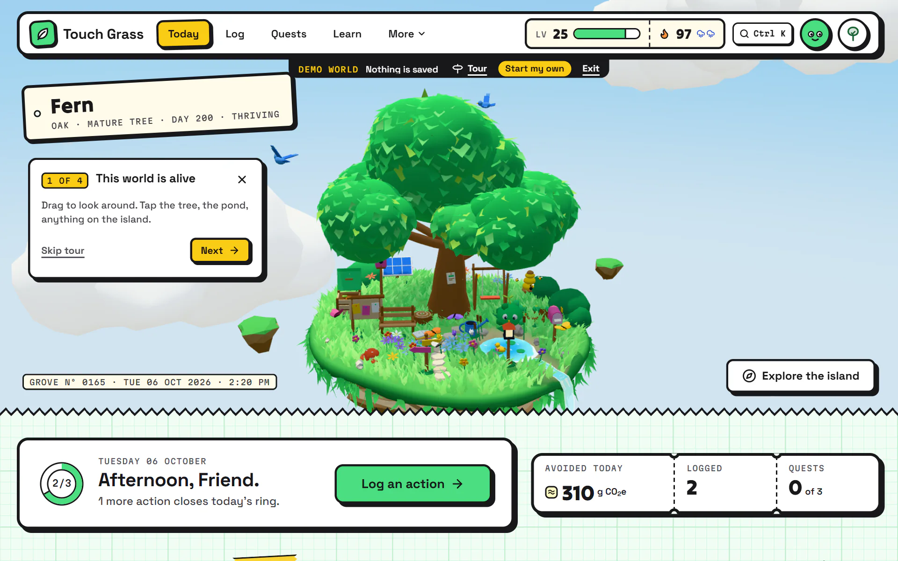
</p>

- "See day 200" replays two hundred days of an ordinary, imperfect habit through the real rules.
- It runs in a sandbox that never reads or changes your own data.
- A four-step tour walks the loop: look around, log an action, see the impact, ask the coach.
- Every number in there was computed, not typed in.

</details>

<details>
<summary><b>8 · Your data</b> &nbsp;yours, on your device</summary>
<br>
<p align="center">
  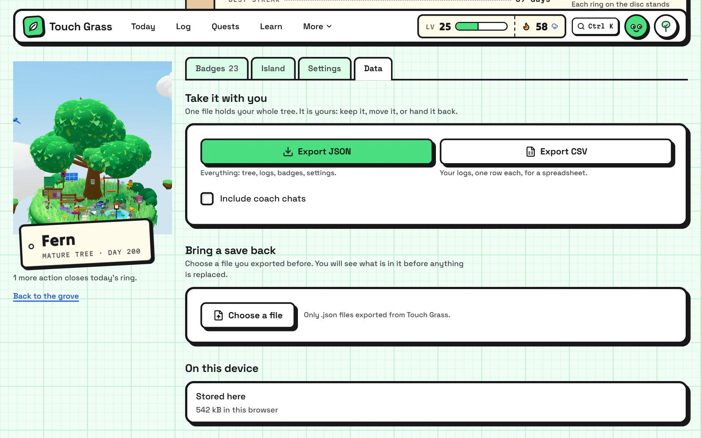
</p>

- Stored in your browser only. No account, no database, no cookies, no analytics, no trackers.
- Export as JSON or CSV, import, or delete everything.
- The export file carries a SHA-256 checksum, and an import is checked before it replaces anything.

</details>

### On a phone

<p align="center">
  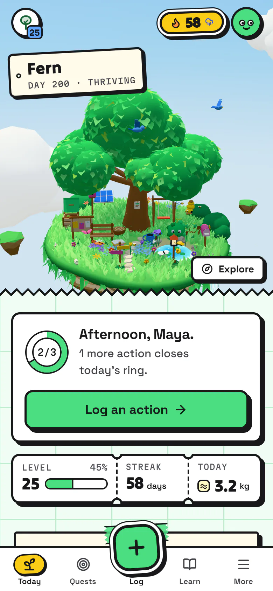
  &nbsp;
  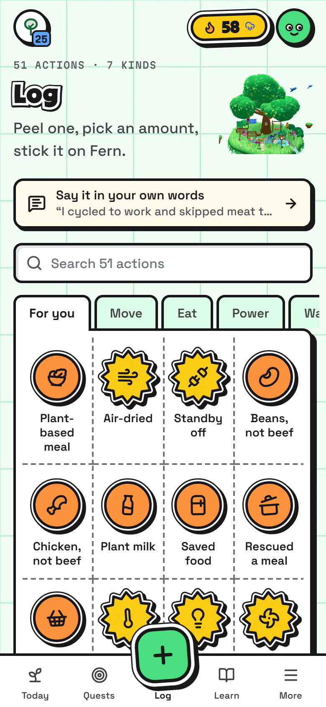
  &nbsp;
  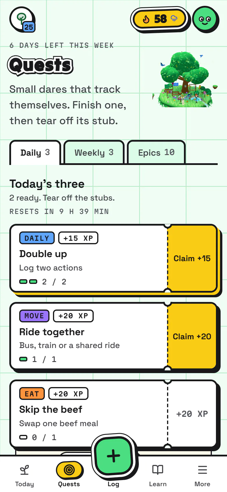
</p>

<p align="right"><a href="#top">Back to top ↑</a></p>

## Why you can trust the numbers

The numbers are the part we are strictest about.

| The rule | What it means in the app |
| --- | --- |
| **Estimates, marked as estimates** | Every figure carries "≈" and two significant figures. No more precision than the source has. |
| **A stated comparison** | A kilometre walked is measured against the same trip in an average car, and the app says so. |
| **A range and a source** | Each factor has a low, a central and a high value and a confidence level: 4 high, 26 medium, 11 low. A figure never goes above the published high value. |
| **No number where none is credible** | 10 actions are "not quantified". They earn XP and print no kilograms. |
| **Your region** | Electricity factors adjust to one of 45 grid regions. |
| **No double counting** | Daily caps, and nine overlap groups: a vegetarian day and its meals cannot both count. |
| **Avoided, never offset** | Totals are never turned into "trees", and kilograms never turn into points. |

What they are not: measurements, offsets or carbon accounting. They rely on you reporting honestly. They are good for scale, and for telling which of your habits carry weight. The method, the regional factors and the known gaps are written up on the app's `/methodology` page.

<p align="right"><a href="#top">Back to top ↑</a></p>

## How it works

### One log, start to finish

Every change goes through one function, `transact(state, now, operation)`. The rules engine is pure TypeScript: the same state, clock and operation always give the same result, which is why the tests can play a whole year.

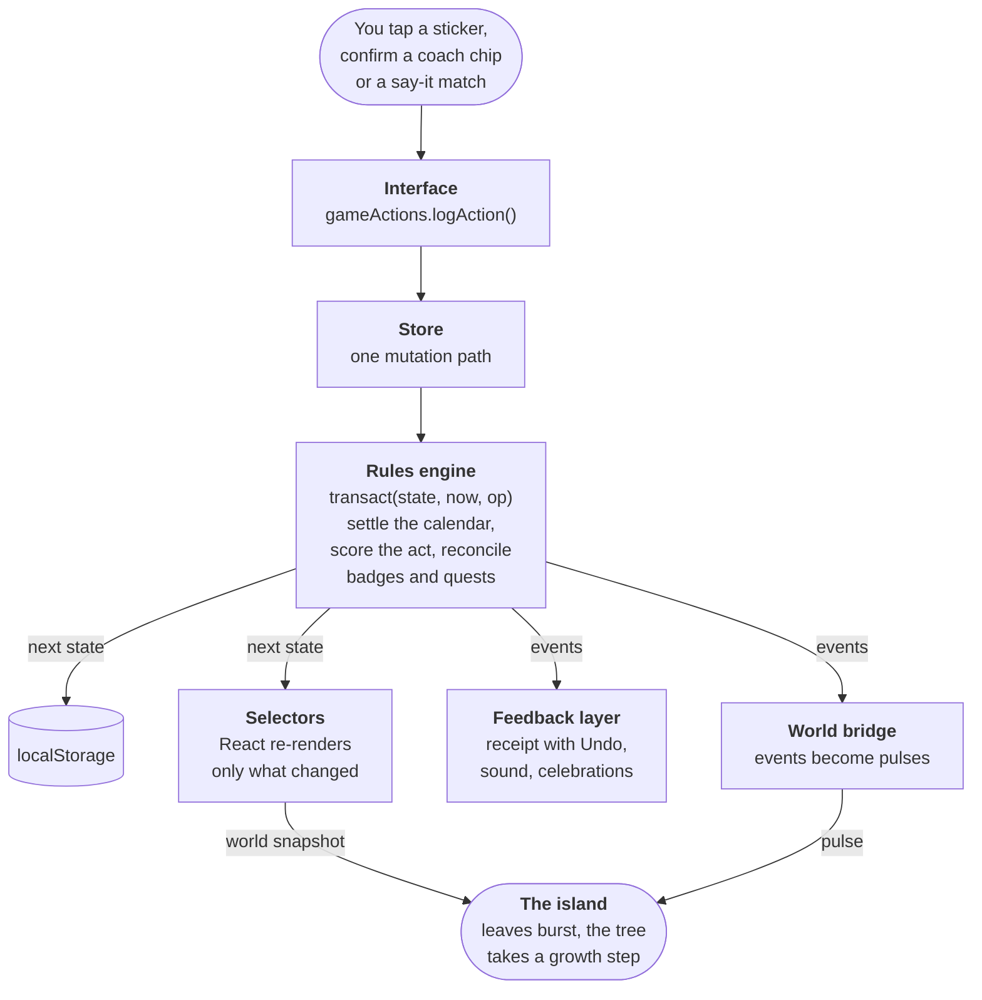
```mermaid
flowchart TD
    you(["You tap a sticker,<br/>confirm a coach chip<br/>or a say-it match"])
    ui["<b>Interface</b><br/>gameActions.logAction()"]
    store["<b>Store</b><br/>one mutation path"]
    engine["<b>Rules engine</b><br/>transact(state, now, op)<br/>settle the calendar,<br/>score the act, reconcile<br/>badges and quests"]
    disk[("localStorage")]
    views["<b>Selectors</b><br/>React re-renders<br/>only what changed"]
    feedback["<b>Feedback layer</b><br/>receipt with Undo,<br/>sound, celebrations"]
    bridge["<b>World bridge</b><br/>events become pulses"]
    island(["<b>The island</b><br/>leaves burst, the tree<br/>takes a growth step"])

    you --> ui --> store --> engine
    engine -- "next state" --> disk
    engine -- "next state" --> views
    engine -- "events" --> feedback
    engine -- "events" --> bridge
    views -- "world snapshot" --> island
    bridge -- "pulse" --> island
```

### The layers

Nothing in the core loop needs a server. The server does two small jobs: it relays coach messages, so the AI key stays off the browser, and it fetches the public climate readings, so the browser never calls a third party.

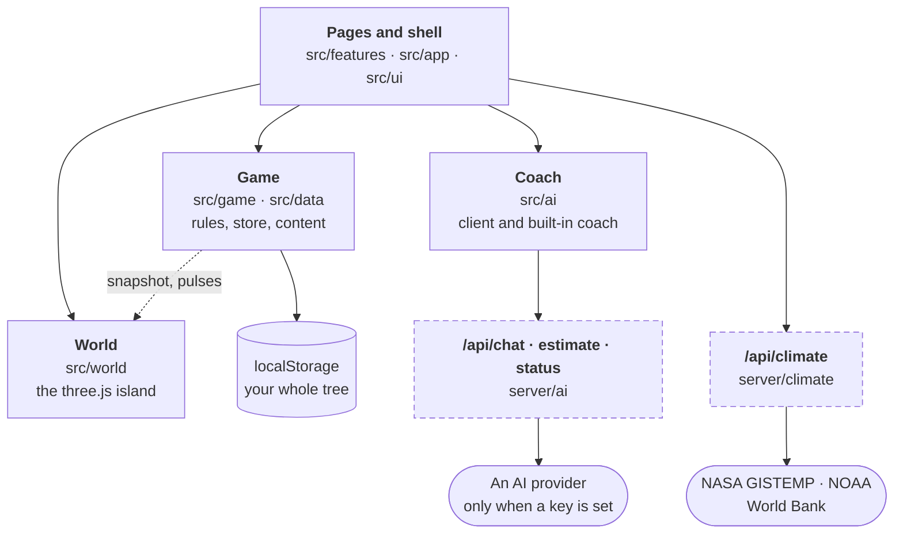
```mermaid
flowchart TB
    pages["<b>Pages and shell</b><br/>src/features · src/app · src/ui"]
    game["<b>Game</b><br/>src/game · src/data<br/>rules, store, content"]
    world["<b>World</b><br/>src/world<br/>the three.js island"]
    coach["<b>Coach</b><br/>src/ai<br/>client and built-in coach"]
    disk[("localStorage<br/>your whole tree")]
    ai["<b>/api/chat · estimate · status</b><br/>server/ai"]
    climate["<b>/api/climate</b><br/>server/climate"]
    provider(["An AI provider<br/>only when a key is set"])
    sources(["NASA GISTEMP · NOAA<br/>World Bank"])

    pages --> game
    pages --> world
    pages --> coach
    game -. "snapshot, pulses" .-> world
    game --> disk
    coach --> ai
    pages ---> climate
    ai --> provider
    climate --> sources

    classDef server stroke-dasharray: 6 4
    class ai,climate server
```

Solid boxes run in your browser. Dashed boxes are the four route handlers on the server.

<details>
<summary><b>Where things live</b></summary>

```text
app/             routes, layouts, API route handlers
server/          the code behind the API routes (AI providers, climate sources)
src/app/         the shell: navigation, HUD, feedback for game events, command palette
src/features/    one folder per page
src/game/        rules engine, store, selectors, events
src/world/       the 3D island, its stage component and the illustrated fallback
src/ui/          the component kit
src/data/        action catalogue, lessons, sources, bundled datasets
src/ai/          browser client for the coach, and the built-in coach
scripts/         screenshot, responsive-audit and frame-time tools, saved states
e2e/             Playwright end-to-end tests
docs/            the pitch, the demo script, the roadmap
```

</details>

<p align="right"><a href="#top">Back to top ↑</a></p>

## The stack

| Part | Choice | Version |
| --- | --- | --- |
| Framework | Next.js (App Router), React, TypeScript in strict mode | 16.3 · 19.2 · 5.8 |
| Styling | Tailwind CSS with design tokens, Radix primitives, Framer Motion | 4.3 · 1.6 · 12.33 |
| 3D | three.js, React Three Fiber, drei; postprocessing on the high tier only | 0.186 · 9.8 · 10.7 · 6.39 |
| State | Zustand, persisted to `localStorage`, over a pure rules engine | 5.0 |
| Charts | Recharts, loaded only on Impact | 3.7 |
| Server | Four route handlers under `app/api`: `chat`, `estimate`, `status`, `climate` | |
| Tests | Vitest and Testing Library; Playwright for end-to-end | 3.2 · 16.3 · 1.63 |

Fonts are Space Grotesk, Tilt Warp and Martian Mono, self-hosted. Sounds are synthesised in the browser. There is no database.

## Getting started

**You need** Node 20.19 or newer, and npm.

```bash
npm install
npm run dev        # http://localhost:5173
```

That is the whole app. To serve a production build instead:

```bash
npm run build
npm run start      # http://localhost:3000
```

### The one optional key

The coach works out of the box: with no key, the built-in coach answers. To switch it to a live model, copy `.env.example` to `.env.local` and fill in one line. A free Groq key is enough.

```bash
cp .env.example .env.local
# then, in .env.local:
AI_API_KEY=gsk_your_key
```

The provider is detected from the key's prefix. No variable starts with `NEXT_PUBLIC_`, so none of them reaches the browser. Open `/api/status` to see which coach is in: `"configured":false` means the built-in one. Every other setting is explained in [`.env.example`](.env.example).

## Scripts

| Command | What it does |
| --- | --- |
| `npm run dev` | Development server on port 5173 |
| `npm run build` | Production build |
| `npm run start` | Serve the production build on port 3000 |
| `npm run preview` | Serve the production build on port 4173, where the end-to-end tests look for it |
| `npm run typecheck` | `tsc --noEmit` |
| `npm run lint` | ESLint |
| `npm run format` · `format:check` | Prettier: write, or only check |
| `npm run test` · `test:watch` | Vitest: unit and component tests |
| `npm run e2e` | Playwright end-to-end tests |
| `npm run check` | Typecheck, lint, test and build, in that order |

<details>
<summary><b>Tools for working on it</b></summary>
<br>

```bash
# A screenshot of any route, in any saved state, with a report of console errors
node scripts/shot.mjs --route today --state day200 --device mobile --out today.png

# Every route at ten widths: overflow, clipped text, small touch targets, runtime errors
node scripts/responsive-audit.mjs --full --state day200

# Frame times of the 3D world on this machine's real GPU
node scripts/world-perf.mjs --route today --state day45

# Re-shoot the pictures on this page from the running app
node scripts/readme-media.mjs stills
```

Saved states live in `scripts/fixtures`: `fresh`, `day1`, `day12`, `day45`, `day200`, `power-user`, `thirsty` and `dormant`.

In a development build, `window.__game.help()` in the browser console lists time travel and other helpers, and `/__ui` and `/__world` open the component and world workbenches.

</details>

<p align="right"><a href="#top">Back to top ↑</a></p>

## Tests and quality

| What | The number |
| --- | --- |
| Unit and component tests | 2,141 tests in 114 files, counted with `npx vitest list` on 7 October 2026 |
| A year in a test | Three simulated users (lazy, typical, power) are played through a whole year; growth must never shrink on any day |
| Claims test | Every number printed in a lesson, myth or fact must have a claim with a source, or the suite fails |
| Responsive sweep | 14 pages at ten widths from 320 to 1,920 px, in four saved states: 0 issues |
| End-to-end | Playwright, on a desktop and a phone profile, against a production build |
| Types and lint | TypeScript in strict mode, ESLint, Prettier |

## Performance

Many people open a web app on a laptop with integrated graphics, so that is the machine the island was built for.

| Page, saved state | Window | Idle | Dragging | Scrolling | Slowest p95 frame | Late frames |
| --- | --- | :-: | :-: | :-: | :-: | :-: |
| Today, day&nbsp;45 | 1440&nbsp;×&nbsp;900 | 59.8&nbsp;fps | 59.2&nbsp;fps | 58.2&nbsp;fps | 17.1&nbsp;ms | 0.9&nbsp;% |
| Today, day&nbsp;45 | 390&nbsp;×&nbsp;844 | 59.8&nbsp;fps | 59.2&nbsp;fps | 60&nbsp;fps | 16.8&nbsp;ms | 0.3&nbsp;% |
| Today, power&nbsp;user | 1440&nbsp;×&nbsp;900 | 59.8&nbsp;fps | 59.2&nbsp;fps | 59.7&nbsp;fps | 17.0&nbsp;ms | 0.6&nbsp;% |
| Landing, first&nbsp;visit | 1440&nbsp;×&nbsp;900 | 60&nbsp;fps | 59&nbsp;fps | 59.5&nbsp;fps | 17.1&nbsp;ms | 0.8&nbsp;% |
| Landing, first&nbsp;visit | 390&nbsp;×&nbsp;844 | 60&nbsp;fps | 59&nbsp;fps | 58.5&nbsp;fps | 17.1&nbsp;ms | 1.4&nbsp;% |

Median frame 16.7 ms and 0 px of drift between the canvas and the page, in every row. "Slowest p95 frame" is the worst 95th-percentile frame of the three phases, and a late frame is one over 20 ms, counted in the worst phase. Measured with `scripts/world-perf.mjs` on a production build on 6 October 2026, on a laptop with integrated graphics (AMD Ryzen 5 7530U, Radeon, 60 Hz).

How it stays there:

- **One WebGL context.** Its canvas node moves into whichever stage is on screen, so the browser's own scrolling moves it.
- **A tier chosen by graphics chip**, not by core count. The tiers are pixel budgets: 1.1, 1.5 and 2.6 megapixels.
- **A frame-pacing governor** lowers the resolution before it lowers the tier, and never while you drag.
- **Nothing is drawn** while the island is off screen or the tab is hidden.
- **three.js and the charts are their own chunks.** Neither is in any route's first load.

<p align="right"><a href="#top">Back to top ↑</a></p>

## Privacy

- **No account and no database.** Your tree is one document in your browser's `localStorage`.
- **Nothing leaves in the background.** No cookies, no analytics, no trackers. The browser makes no third-party requests.
- **What can leave, and when.** A message you choose to send to the coach goes through our server to the AI provider, if a key is set. Your name is never sent, and the block of stats that goes with a message can be switched off.
- **It is yours.** Export it, import it, or delete all of it, from Me or from the app's `/privacy` page.

## Honest limits

We would rather you read these here than find them.

- **A tree lives in one browser.** Clear the site data and it is gone, unless you exported a copy. There is no second device yet.
- **No offline start.** A page that is open keeps working without a connection: you can log, and the tree grows. Opening or reloading the app still needs one, because there is no service worker yet.
- **Community is in local mode.** A private journal, a share card, challenge links you send yourself, and eight editorial notes. No feed, and no invented users.
- **Estimates are estimates.** Most transport, waste and home-energy factors are UK or US values. The app says where.
- **The live coach has only met simulated providers.** No real provider key has been used with this build yet. The built-in coach is the tested path.
- **Not yet held in a hand.** Automated checks run in Chromium at desktop and phone sizes. There is no test yet on a physical phone, in Safari or Firefox, or with a screen reader.
- **The high graphics tier is unmeasured** on a discrete card. Integrated graphics get the medium tier, which is the one in the table above.
- **Two readings come through a mirror.** Methane and nitrous oxide are read from a site that republishes NOAA's series, and the page says "via".
- **No licence yet.** The repository has no licence file; the owner has not chosen one.

<details>
<summary><b>Three questions a jury asks</b></summary>
<br>

<details>
<summary><b>How accurate are the numbers?</b></summary>
<br>

They are estimates, and the app says so on every one. Each figure is the emissions avoided against a stated alternative. It is not a measurement, an offset or carbon accounting, and it depends on honest reporting.

What keeps it honest: 41 of the 51 actions have a factor from a published source, with a low, a central and a high value and a confidence level. The other 10 print no figure. Figures are rounded to two significant figures and never exceed the published high value. Electricity factors adjust to 45 regions. Daily caps and overlap rules stop one habit being counted twice.

</details>

<details>
<summary><b>Why is there no backend yet?</b></summary>
<br>

It is a choice, and it has a cost. With no account and no database, starting takes about a minute, nothing personal sits on a server, and the core loop cannot be slowed or stopped by one.

The cost: a tree lives in one browser, there is no second device, and Community is in local mode. The next step is optional accounts with backup and sync. The plan and the migration path are in [the roadmap](docs/roadmap.md).

</details>

<details>
<summary><b>How is the AI used?</b></summary>
<br>

In three places, all optional. Moss answers questions and can suggest an action. A custom action that is not in the catalogue can get a cautious estimate, capped at 2 kg per log and 5 kg per day and kept out of the headline total. "Say it in your own words" can use the model to match a sentence to catalogue actions.

The guard rails: the model never logs anything, you confirm every log. The system prompt is built on the server, and the browser cannot choose the model or the prompt. Your name is never sent. Requests are limited to 30 an hour per visitor on each server instance. Without a key, or when the provider fails, the built-in coach answers and is labelled "Built-in".

</details>

</details>

<p align="right"><a href="#top">Back to top ↑</a></p>

## Roadmap

1. **Optional accounts with backup, then sync**, so a tree survives a cleared browser and follows you between devices.
2. **A service worker**, so the app also opens with no connection.
3. **Kind reminders** that never guilt-trip.
4. **A real community**: friends, challenges that track both sides, groups ranked by effort instead of tonnes, with moderation in place first.
5. **The live coach against real provider keys**, then your own vehicle and energy data, and more languages.

The details, a backend comparison and the migration path are in [docs/roadmap.md](docs/roadmap.md).

## More to read

| Document | What is in it |
| --- | --- |
| [The pitch](docs/pitch.md) | The product in one sentence, thirty seconds and two minutes, and what makes it different |
| [The project story](docs/project-story.md) | How it was built, what went wrong on the way, and what we learned |
| [The demo script](docs/demo-script.md) | A two-minute walk-through, word for word, and what to do when something goes wrong |
| [The roadmap](docs/roadmap.md) | What comes next: features, a backend, AI providers with a free tier |
| [Submission answers](docs/submission-answers.md) · [Submission kit](docs/submission-kit.md) | The hackathon entry's own paperwork |

In the app, `/methodology` has every factor and source, and `/privacy` says what is stored and what can leave the device.

## Credits and licences

- **Climate data.** NASA Goddard Institute for Space Studies (GISTEMP), NOAA Global Monitoring Laboratory, the World Bank.
- **Emission factors.** The 55 sources listed on the app's `/methodology` page.
- **3D assets.** None from a third party. The island, the tree, the props and the creatures are generated in code. See [public/models/CREDITS.md](public/models/CREDITS.md).
- **Fonts.** Space Grotesk, Tilt Warp and Martian Mono, self-hosted through Fontsource, each under the SIL Open Font License 1.1.
- **The pictures on this page.** Captured from the running app by [`scripts/readme-media.mjs`](scripts/readme-media.mjs). The banner is drawn for this page, in the app's own sticker style.

<p align="center">
  <br>
  <b>Now close this tab and go touch some grass.</b>
  <br><br>
  <a href="#top">Back to top ↑</a>
</p>
